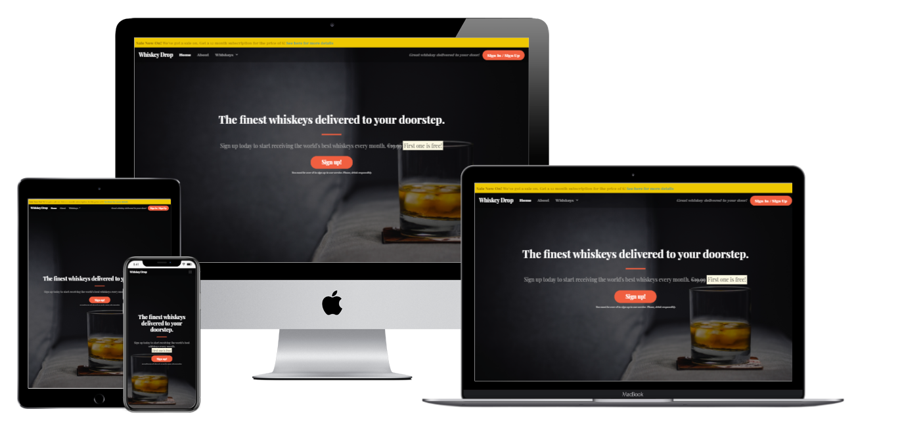

# Whiskey Drop - about the project

First page project for the whiskey shop.

Project is a part of the software development study path in code institute.

All project was done by following the tutorials and instruction provided by [code institute](https://codeinstitute.net/).

## Project goals

The main goal of project was to learn of using the bootstrap framework.

The secondary goal was to adjust the bootstrap wireframe to give more originally look for website.

## What i learned during this project?

How to create the first website page for client.

How to import bootstrap, fontewaseome icons and google fonts to the project.

How to use bootstrap elements.

How to overwrite bootstrap CSS to make changes.

The HTML structure.

How to import boostrap java script elements.

How to import jquery.
## Technologies used

* HTML5
* CSS
* Bootstrap4
* fontawesome
* google fonts

## Remarks

Project is only the first page and all links doesn't work.